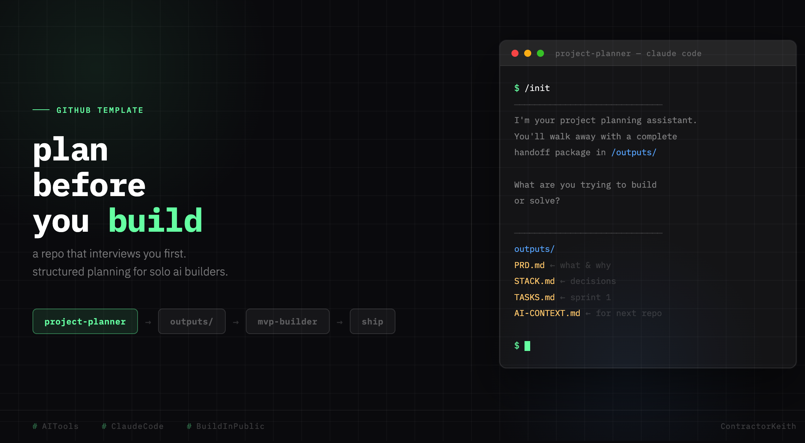

# project-planner



A planning-only repo. No code gets written here.

Open it in Claude Code, Codex, or Gemini CLI. Say `/init` or describe what you want to build.
Walk through a short interview. Walk away with a `/outputs` folder ready to drop into your next repo.

---

## What you get

```
outputs/
├── PRD.md        ← what you're building and why
├── STACK.md      ← tech decisions with rationale
├── TASKS.md      ← first sprint
└── [TOOL].md     ← context file for your next repo (named for your AI tool)
```

The context file is named based on the tool you're using: `CLAUDE.md` for Claude Code,
`AGENTS.md` for Codex, `GEMINI.md` for Gemini CLI.

Drop `outputs/` into your build repo. Your AI assistant has full context from the
first message. No re-explaining.

> **Using mvp-builder?** Rename the context file to `CONTEXT.md` before dropping it in.

> **Companion template:** [mvp-builder](https://github.com/ContractorKeith/mvp-builder) — picks up where this repo leaves off.

---

## Getting started

**Option 1 — Use as a GitHub template** (recommended):
Click the **"Use this template"** button on GitHub to create your own copy.

**Option 2 — Clone directly:**
```bash
git clone https://github.com/ContractorKeith/project-planner.git my-project-planner
cd my-project-planner
```

---

## How to use

The orchestrator file is `CLAUDE.md`. Each AI tool reads it automatically:

| Tool | Setup |
|---|---|
| Claude Code | Works out of the box — reads `CLAUDE.md` automatically |
| OpenAI Codex | Copy or rename `CLAUDE.md` to `AGENTS.md` |
| Gemini CLI | Copy or rename `CLAUDE.md` to `GEMINI.md` |

**Start a session:**
```
/init
```
Or just describe what you want to build. The orchestrator will take it from there.

---

## Structure

```
project-planner/
├── CLAUDE.md              ← orchestrator
├── README.md
├── LICENSE
├── CONTRIBUTING.md
│
├── skills/
│   ├── skill-creator.md   ← create new skills mid-session
│   ├── problem-framing.md ← extracts the problem
│   ├── stack-selection.md ← defines the technical shape
│   └── prd-writing.md     ← generates /outputs/
│
├── examples/              ← sample outputs from a fictional project
│   ├── README.md
│   ├── PRD.md
│   ├── STACK.md
│   ├── TASKS.md
│   └── CLAUDE.md
│
└── outputs/               ← generated per session, gitignored by default
```

---

## Example outputs

The `examples/` folder contains sample outputs from a fictional project (TaskTrail — a CLI task tracker).
Browse them to see what your own `/outputs/` folder will look like after a session.

---

## Growing the skill set

If a planning need comes up that isn't covered by an existing skill, ask the AI to
create one using `skills/skill-creator.md`. It lands in `/skills/` and is available
immediately and in every future session.

---

## Part of a larger chain

```
project-planner  →  outputs/  →  build repo  →  ship
```

Each repo has one job. This one's job is planning.

> See [mvp-builder](https://github.com/ContractorKeith/mvp-builder) for the next link in the chain.

---

## License

MIT
